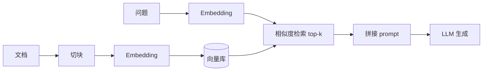

# 检索增强生成 RAG:给大模型装上"外接知识库"

> **一句话摘要**:大模型知识是"罐装"的,会过时、会幻觉。RAG 在生成前先检索外部知识再作答,是低成本缓解幻觉、接入私有数据的标准方案。本文讲清全流程、embedding、chunking 与评估。
>
> **来源**:综合公开资料 —— RAG 论文(Lewis et al., 2020)、LangChain / LlamaIndex 文档。

## 概念

- **为什么需要 RAG**:
  - **知识过时**:训练截止后的新闻、政策、产品信息,参数里根本没有;
  - **幻觉(Hallucination)**:没有"证据约束",模型会一本正经地编造;
  - **私有数据**:企业文档、个人笔记不可能(也不应)训进模型;
  - 微调难以注入海量新知识,且每次更新都要重训(见 [微调](fine-tuning.md))。
- **RAG 的定义**:生成前**先从外部知识库检索**相关片段,拼进 prompt 再让 LLM 基于证据回答。**知识在外置硬盘,模型只负责"读盘 + 组织语言"**。
- **RAG vs 微调**:RAG 管"知道什么"(事实、时效、私域),微调管"怎么回答"(风格、行为)。常组合:先 RAG 保事实,再微调保语气。

## 原理

### 全流程:离线索引 + 在线检索生成

**离线索引**(可增量更新):采集文档 → 清洗 → **切块(Chunking)** → 每块用 embedding 转成向量 → 存入向量库。

**在线问答**:问题 → embedding → 向量库**相似度检索**取 top-k → 命中原文拼进 prompt → LLM 带依据作答。



### Embedding 与向量检索

- **Embedding**:把文本映射为固定维稠密向量(768/1536 维),**语义相近则向量距离近**。相似度常用余弦:

$$\text{sim}(q, d) = \frac{\vec{q} \cdot \vec{d}}{\|\vec{q}\| \cdot \|\vec{d}\|}$$

- **向量数据库**:Milvus、Qdrant、Chroma、FAISS,支持 ANN 索引(如 HNSW),千万级向量毫秒检索。
- **注意**:检索质量上限由 embedding 决定,文档与问题须用同一套编码。

### Chunking 切块

- 太小 → 语义碎片化;太大 → 混入无关内容、检索精度降。经验窗口 **200~800 token**,相邻块**少量重叠**防关键信息被切断。
- 进阶:**语义切块**(按标题/段落/句子边界)与**元数据标注**(来源、章节、时间),提高命中并便于引用。

### RAG 评估

| 层级 | 指标 | 看什么 |
|---|---|---|
| 检索质量 | Recall@k、命中率 | top-k 里有没有正确答案/相关块 |
| 生成质量 | 忠实度(Faithfulness)、答案相关 | 回答是否忠于检索片段、是否答非所问 |
| 端到端 | 正确率、引用覆盖率、无幻觉率 | 用户实际体验 |

- 检索坏 → 生成必坏(没有证据可引);生成坏 → 换 prompt 或微调。**先修检索,再修生成**。

!!! warning "幻觉并未消失"
    RAG 降低的是"无中生有"式幻觉;若检索片段本身错误,或 LLM 忽略检索内容(尤其上下文过长),幻觉仍在。工程上要"检索不到就明说 + 强制引用出处"。

## 代码 / 实现

纯 Python 实现最简 RAG 检索:词袋向量(BoW)+ 词干化 + 余弦相似度 + top-k。真实系统只把"词袋向量"换成"embedding 向量",其余流程完全一致:

```python
import numpy as np

docs = [
    "the transformer model uses attention to capture long range dependency",
    "lora uses low rank decomposition to reduce the number of finetuning parameters",
    "kv cache caches past keys and values to speed up inference",
    "rlhf trains a reward model from human feedback to align the model",
    "rag uses retrieval to augment generation and reduce hallucination",
    "quantization compresses the weights to low bit width to save gpu memory",
]

def stem(w):
    """极简词干化:去常见后缀,让 retrieval/retrieves 等形态能匹配"""
    for suf in ("ing", "ed", "es", "s"):
        if len(w) > 4 and w.endswith(suf):
            return w[:-len(suf)]
    return w

def tokenize(text):
    return [stem(w) for w in text.lower().split()]

def build_vocab(docs):
    return sorted({w for d in docs for w in tokenize(d)})

def bag_of_words(text, vocab):
    vec = np.zeros(len(vocab))
    for w in tokenize(text):
        if w in vocab:
            vec[list(vocab).index(w)] += 1
    return vec

def cosine(a, b):
    return float(a @ b / (np.linalg.norm(a) * np.linalg.norm(b) + 1e-12))

vocab = build_vocab(docs)
matrix = np.array([bag_of_words(d, vocab) for d in docs])

query = "how to reduce hallucination with retrieval augmented generation"
qv = bag_of_words(query, vocab)
scores = [(cosine(qv, row), i) for i, row in enumerate(matrix)]
top = sorted(scores, reverse=True)[:3]

print("检索结果 top-3:")
for s, i in top:
    print(f"  sim={s:.3f}  {docs[i]}")
```

- 模拟 RAG 的**检索环节**:离线建文档向量矩阵,在线把问题转同一空间向量,余弦排序取 top-k。
- **词袋局限**:只认字面重叠,不认语义("car" 与 "vehicle" 不匹配)——这正是真实系统必须用 embedding 的原因;把 `bag_of_words` 换成 `embedding_model.encode(text)` 即得真实 RAG。
- 运行方式:`python3 rag_demo.py`,仅依赖 numpy。

**生产链路**(需要 `pip install langchain chromadb`):

```python
from langchain_community.vectorstores import Chroma
from langchain_openai import OpenAIEmbeddings
from langchain.text_splitter import RecursiveCharacterTextSplitter

splitter = RecursiveCharacterTextSplitter(chunk_size=500, chunk_overlap=50)
chunks = splitter.split_documents(your_docs)          # 切块
db = Chroma.from_documents(chunks, OpenAIEmbeddings())  # 建索引
hits = db.similarity_search("什么是 KV Cache?", k=3)   # 检索
# 把 hits 的 page_content 拼进 prompt 再交给 LLM 生成
```

## 实践 / 应用

- **RAG vs 微调怎么选**(见对比表):更新频繁的事实/私有文档 → RAG;回答风格、输出格式、领域话术 → 微调。

| 维度 | RAG | 微调 |
|---|---|---|
| 知识更新 | 换库即生效,秒级 | 重训+验证,天级 |
| 幻觉 | 大幅缓解,有出处可查 | 缓解有限 |
| 私有数据 | 无需训练即可接入 | 需高质量标注数据 |
| 可解释性 | 可追溯引用来源 | 不可解释 |
| 延迟/成本 | 多一次检索调用 | 推理成本不变 |
| 典型场景 | 客服知识库、财报问答、论文助手 | 领域风格、指令格式、特定任务 |

- **工程要点**:①检索质量优先——embedding 选型、切块、元数据过滤影响最大;②**混合检索**加分(BM25 + 向量 + Reranker 重排);③"无命中"做成显式回答;④缓存高频问题检索结果。
- **常见坑**:整篇文档塞进向量库(必须切块);中文要选友好 embedding 模型;检索片段拼太多导致 LLM 忽略证据(控制总长);评估只测端到端、不看检索召回(定位不了问题)。

## 总结

- RAG 让知识外置:生成前检索证据,缓解幻觉、支持实时更新、接入私有数据。
- 全流程 = 离线索引(切块 → embedding → 向量库)+ 在线检索生成(query embedding → top-k → prompt)。
- 检索是地基:embedding、切块、重排决定上限;"先修检索,再修生成"。
- RAG 管知识、微调管行为,两者组合是生产级主流架构。

**下一步**:回顾 [微调](fine-tuning.md) 与 [RLHF](rlhf-alignment.md);在 [Agent 章节](../03-agents/index.md) 学习让 RAG 升级为"多步工具调用"。

## 延伸阅读

- 站内:[微调 Fine-tuning](fine-tuning.md)、[RLHF 与对齐](rlhf-alignment.md)、[推理与部署](inference-deployment.md)
- 外部:RAG 论文(Lewis et al., 2020);LangChain / LlamaIndex 文档;RAG Survey(Gao et al., 2023)
